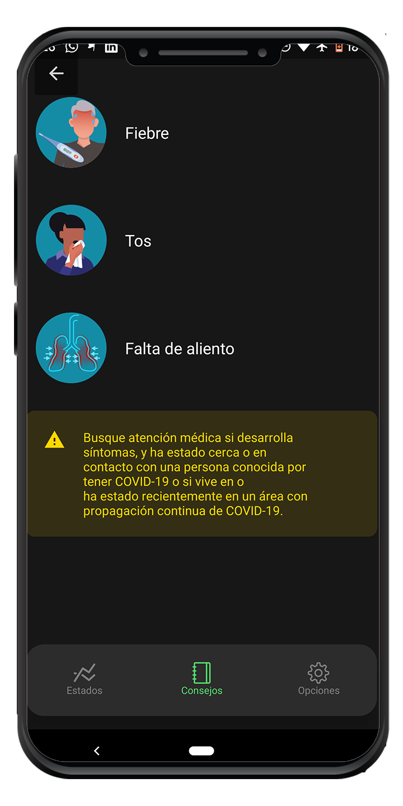

# 📱 Colombia COVID-19 Monitor (Virus Monitor)

[](http://makeapullrequest.com)
[](https://www.npmjs.com/package/redux-saga)
[](https://travis-ci.org/redux-saga/redux-saga)
[](https://gitter.im/yelouafi/redux-saga?utm_source=badge&utm_medium=badge&utm_campaign=pr-badge&utm_content=badge)

Una aplicación en React Native Appp creada para hacer un monitoreo del COVID-19 los casos positivos, recuperdados y muertos con información importante y de interes. 
La información que la app provee es verificada por instituciones de alta reputación como lo es World Health Organization (WHO), the US Centers for Disease Control and Prevention (CDC), 
the Chinese Centre for Disease Control and Prevention (ECDC) and the Nigeria Center for Disease Control (NCDC).
Todo gracias a la api [API](https://github.com/mathdroid/covid-19-api) como servidor de backend.

# ⬇ Descargalo ahora para Android ⬇
https://drive.google.com/open?id=1SleOZXIc42r2aQgx39oeq5gH-uBBUNIU

## Herramientas usadas en el projecto
* [Expo](https://expo.io/) para compilar y en etapa de desarrollo.
* [ES6](http://es6-features.org) lenguaje principal.
* [Sagas](https://redux-saga.js.org/) para manejo asincriono.
* [Mocha](https://mochajs.org) testing framework.
* [Chai](http://chaijs.com) como TDD assertion library.
* [ESLint](http://eslint.org) como JavaScript linter.
* [eslint-config-airbnb](https://github.com/airbnb/javascript/tree/master/packages/eslint-config-airbnb) guias de estilo para el codigo


## Flujo de trabajo y guias de estilos
Nosotros usamos [airbnb-javascript](https://github.com/airbnb/javascript) como guia de estilo para JavaScript.

**Reglas:**

* Para todas las aciones asincronas se usara sagas
* Todos los bug deberan ser registrados como un issue
* Tu codigo debe estar enteramente en ingles con sola las traduciones en la carpeta src/translations y ya poner la corespondiente dependiendo del idioma
* Tu codigo debería seguir estas [airbnb-javascript](https://github.com/airbnb/javascript) guias de estilo, por esto la recomendación es instalar la aplicación de eslint en tu editor preferiblemente [VsCode](https://code.visualstudio.com/)
* Tu codigo debe intentar ser lo mas minimalista posible
* Tu deberías intentar usar testing en tu codigo pero no es un requerimiento

**Nota:** _Tu codigo puede ser rechazado por incumplir las reglas mencionadas anteriormente._


## Contribuir al proyecto
Si tu quieres contribuir al proyecto debes seguir las reglas [**Reglas**](#workflow-and-code-style-guide) y tener en mente los siguiente puntos:
* Tu proyecto local debe tener instalado el ESLint, recomendamos instalarlo global: ```npm install -g eslint```
* Si usas [VsCode](https://code.visualstudio.com/) te recomendamos instalar el plugin ```"Eslint dbaeumer.vscode-eslint```dentro de tu proyecto.


## Correr el proyecto


***install las dependencias de manera global***

`npm install`

`npm install -g expo`

`npm start`


1. Instalar todas las dependencias.
2. Instalar expo de forma global. Paso extra crearse una cuenta si aún no se tiene
3. Iniciar la aplicación la cual creara un servidor y ya puedes conectar el emulador mobil dependiente de la necesidad.

# ⚙ Features
- Ver todos los casos en Colombia
- Obtener actualizaciones de fuentes confiables(OMS)
- Lineas de atención
- Recomendaciones, cuidados y sintomas

# 🧾 To-Do List
- Obtener detalles a nivel mas especifico por ciudades de colombia
- Crear ayudas para manejo de ansiedad y de estress

# 📸 Screenshots
<div style="background-color:rgb(169,169,169); text-align:center">

&nbsp;

</div>
<div style="background-color:rgb(169,169,169); text-align:center">

&nbsp;

</div>

# 🤓 Contributor(s)
- Oyefeso Oluwatunmise [](https://twitter.com/oyefesotunmise)
- Joseph Olabisi [](https://twitter.com/acerg00ber)
- Wilson Ospina [](https://twitter.com/wdospinal)

# 🧾 License - MIT License
Copyright (c) 2020 Vironitor - Released under the <a href="https://github.com/wdospinal/react-native-covid19-col/blob/master/LICENSE.txt">MIT license.</a>
